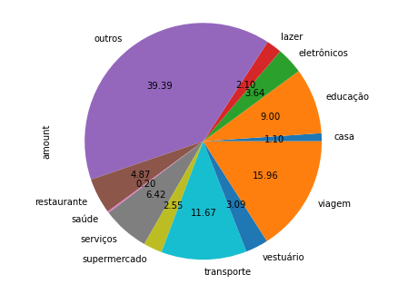
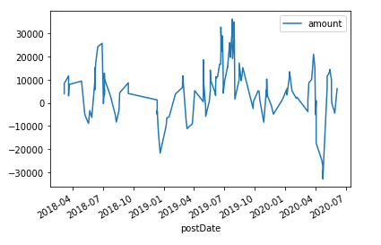
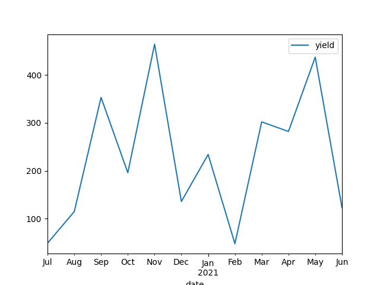

# Análisando os dados
O Nubank retorna todos os dados em formato JSON, para visualizar as informações disponíveis basta printar o resultado de algum método.

Os exemplos abaixo utilizam as bibliotecas `pandas` e `matplotlib` para fazer a visualização dos dados.

```python
from pynubank import Nubank

nu = Nubank()
# Assumindo que você já fez a autenticação aqui

# Assim é possível ver todos os dados
print(nu.get_card_statements())
```

## Gastos por categoria
O Nubank faz uma categorização dos gastos, sendo possível agrupar essas informações e gerar um gráfico com a biblioteca `matplotlib`

```python
from pynubank import Nubank
import pandas as pd
nu = Nubank()
# Assumindo que você já fez a autenticação aqui

# Recupera as compras feitas no cartão
transactions = nu.get_card_statements()

# Agrupa pelo campo "title" que é a categoria e soma os valores
df = pd.DataFrame(transactions).groupby(['title']).sum()

# Plota o gráfico baseado no campo amount
df['amount'].plot.pie(figsize=(6, 6), autopct='%.2f')
```

Resultado:



## Evolução do Saldo da Nuconta
Podemos fazer o acompanhamento da evolução do saldo da NuConta somando o campo amount.

```python
from pynubank import Nubank
import pandas as pd
nu = Nubank()
# Assumindo que você já fez a autenticação aqui

# Recupera as transações da NuConta
transactions = nu.get_account_statements()

IN_EVENT = ['TransferInEvent', 'TransferOutReversalEvent']

# Transformamos os valores que não são TransferInEvent em negativo
# Para que a soma seja feita corretamente
def transform_value(transaction):
    if not transaction.get('__typename') in IN_EVENT:
        transaction['amount'] = transaction['amount'] * -1
    return transaction

transactions = list(map(transform_value, transactions))

# Transforma as transações num DataFrame
df = pd.DataFrame(transactions)

# Faz parse do campo postDate para podermos agrupar por mês
df['postDate'] = pd.to_datetime(df['postDate'])
df.index = df.postDate

# Inverte a ordem do DataFrame para que fique na ordem crescente
df = df.iloc[::-1]

# Agrupa por mês e faz a soma cumulativa dos dados
df.groupby(pd.Grouper(freq='M')).sum().cumsum().plot()
```

Resultado:



## Rendimento histórico da NuConta

```python
from datetime import datetime

import pandas as pd
from dateutil.relativedelta import relativedelta

from pynubank import Nubank

nu = Nubank()
# Assumindo que você já fez a autenticação aqui

no_of_months = 12  # Quantos meses para trás queremos obter os dados
yield_data = []
now = datetime.now()

# Obtem os dados dos ultimos 12 meses
for i in range(no_of_months):
    ref_date = datetime(now.year, now.month, 1) - relativedelta(months=i)
    yield_data.append({
        'date': ref_date.strftime('%Y-%m-%d'),
        'yield': nu.get_account_investments_yield(ref_date)
    })

    df = pd.DataFrame(yield_data)

df['date'] = pd.to_datetime(df['date'])
df.index = df.date
df.groupby(pd.Grouper(freq='M')).sum().plot()
```

Resultado:


