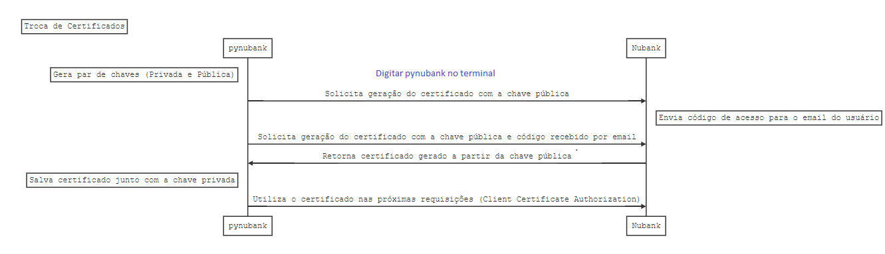

# Autenticação por Usuário e Senha com certificado
Ao utilizar a autenticação com certificado, você estará reproduzindo o fluxo de acesso pelo app.



Após instalar a biblioteca, utilize o comando `pynubank` no terminal para iniciar o processo de geração de certificados: arquivo `cert.p12`.

Insira as suas credentials que você receberá um email do Nubank com o código de acesso e será gerado um certificado (Que você deve manter em um lugar seguro)

Com o certificado gerado, é possível fazer o login sem interação humana (Ideal para scripts)

Se executado com sucesso, será gerado um arquivo `cert.p12` **mantenha ele em lugar seguro**. Esse certificado será utilizado pela lib para se comunicar com o servidor do Nubank.

```python
from pynubank import Nubank

nu = Nubank()
nu.authenticate_with_cert('123456789', 'senha', 'caminho/do_certificado.p12')
print(nu.get_account_balance())
```
