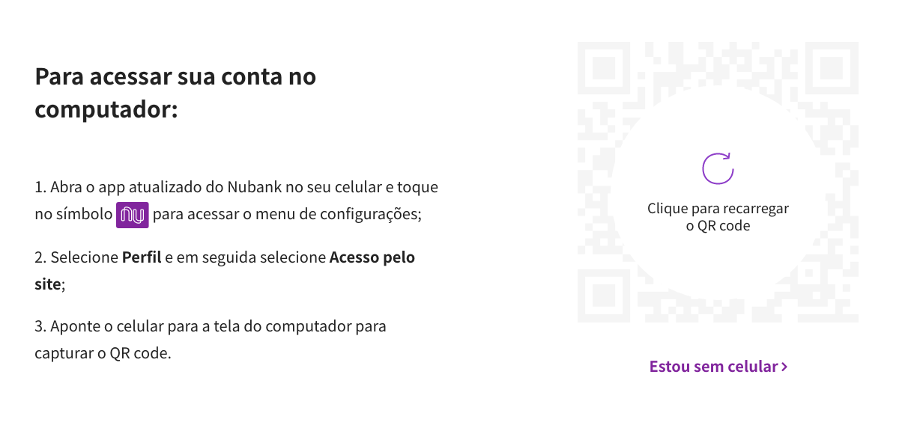

# Autenticação por QRCode
Ao utilizar a autenticação por QRCode, você estará reproduzindo o fluxo de acesso feito no app web:



> :warning:  No passado era possível acessar os dados da Nuconta através desse método de autenticação, porém recentemente o Nubank passou a bloquear esse acesso.

Dessa maneira sempre será necessário utilizar o celular para escanear o QRCode e autorizar o acesso.

```python
from pynubank import Nubank

nu = Nubank()
uuid, qr_code = nu.get_qr_code()
# Nesse momento será printado o QRCode no console
# Você precisa escanear pelo o seu app do celular
# Esse menu fica em NU > Perfil > Acesso pelo site
qr_code.print_ascii(invert=True)
input('Após escanear o QRCode pressione enter para continuar')
# Somente após escanear o QRCode você pode chamar a linha abaixo
nu.authenticate_with_qr_code('123456789', 'senha', uuid)
print(nu.get_account_balance())
```